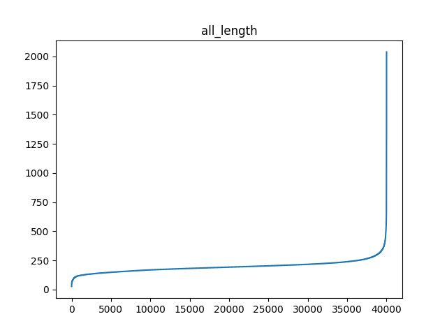

## CCKS 2021：医疗科普知识答非所问识别 - baseline

线上得分应该在83左右，线下应该在90左右。欢迎使用。使用pytorch和robert-large


#### 第一步： 读取数据(read.py)

请提前将**wa.test.phase1.fixtab.valid.tsv**和**wa.train.fixtab.valid.tsv**文件放置baseline文件夹下。

```python
import pandas as pd
import ast
from tqdm import trange
import random
train = []
train_data = []

with open("wa.train.fixtab.valid.tsv", "r",encoding='utf-8') as f:
    for line in f.readlines()[1:]:
        line = line.strip('\n')
        line = line.split('\t')
       train.append({'label':line[0],'docid':line[1],'question':line[2],'description':line[3],'answer':line[4]})
train = pd.DataFrame(train)
train.to_csv('data_all.csv')
```

‘read.py’文件会读取wa.train.fixtab.valid.tsv数据，并生成data_all.csv文件，此文件包含

| label | docid   | question             | description                                                  | answer                                                       |
| ----- | ------- | -------------------- | ------------------------------------------------------------ | ------------------------------------------------------------ |
| 0     | 1000001 | 大腿吸脂多久看到效果 | 我大腿很粗，而且看起来就像大象腿一样，想问一下选择大腿吸脂多久看到效果呢？ | 通过吸脂的方式确实能够让您大象腿的问题得到有效的治疗，一般来说一个月左右就会有明显的效果，因此您可以根据自身的实际情况进行检查，这样也能够选择适合您的方式进行减肥，达到理想的效果。 |
| ...   | ...     | ...                  | ...                                                          | ...                                                          |

###### 查看数据

```python
import numpy as np
import matplotlib.pyplot as plt

train['description_len'] = train['description'].apply(len)
train['question_len'] = train['question'].apply(len)
train['answer_len'] = train['answer'].apply(len)
train['all_len'] = train['question'].apply(len)+train['description'].apply(len)+train['answer'].apply(len)
print(train.description_len.describe())
print(train.question_len.describe())
print(train.answer_len.describe())
print(train.all_len.describe())
```

```
Backend TkAgg is interactive backend. Turning interactive mode on.
count    40000.000000
mean        54.261900
std         37.520871
min          2.000000
25%         32.000000
50%         56.000000
75%         70.000000
max       1892.000000
Name: description_len, dtype: float64
count    40000.000000
mean        11.457400
std          3.548591
min          2.000000
25%          9.000000
50%         11.000000
75%         13.000000
max        266.000000
Name: question_len, dtype: float64
count    40000.000000
mean       129.949925
std         41.065728
min          3.000000
25%        107.000000
50%        124.000000
75%        150.000000
max       1348.000000
Name: answer_len, dtype: float64
count    40000.000000
mean       195.669225
std         52.109252
min         26.000000
25%        168.000000
50%        192.000000
75%        216.000000
max       2039.000000
Name: all_len, dtype: float64
```

```
plt.title('all_length')
plt.plot(sorted(train.all_len))
plt.show()
```



由图可知，大部分的文章长度在300以下，因此max_len设置为300.

#### 第二步：训练模型(main.py)

使用roberta-large预训练模型，通过fgm对抗学习，最后十折交叉验证模型。

我是分别使用3080笔记本和3090台式机进行训练的，3090上一个epoch27分钟，3080笔记本一个epoch44分钟。如果时间不够，你可以在第一个模型训练完成后就退出，单模型线上分数应该会在83以上。显存建议10G以上，如果不够可换成base模型


##### 注意，虽然说代码里写的是十折交叉验证，不过我算力有限，只完成第一个模型的训练，83的分数是单模型，不进行其他处理的分数。实际十折交叉验证结果不太确定，有的时候随机种子也挺重要的。。。
```
CFG = { #训练的参数配置
    'fold_num': 10, #十折交叉验证
    'seed': 2,#随即种子
    'model': 'luhua/chinese_pretrain_mrc_roberta_wwm_ext_large', #预训练模型
    'max_len': 300, #文本截断的最大长度
    'epochs': 5,
    'train_bs': 9, #batch_size，可根据自己的显存调整
    'valid_bs': 9,
    'lr': 1e-5, #学习率
    'num_workers': 0,
    'accum_iter': 3, #梯度累积，相当于将batch_size*2
    'weight_decay': 1e-4, #权重衰减，防止过拟合
    'device': 0,
}
```

[^如果需要调参，可直接在CFG中修改]: 


#### 第三步： 生成提交文件(test.py)

在这一步中你可以使用之前训练好的模型，你可以自由选择需要哪几个模型，建议选F1值高的，之后将模型的名字填在test.py第82行，并在最后一行将提交名字修改为你的队伍名。

```
for m in ['']:  #这里添加你认为优秀的模型
    model.load_state_dict(torch.load(m))
    y_pred = []
    with torch.no_grad():
      tk = tqdm(test_loader, total=len(test_loader), position=0, leave=True)
      for idx, (input_ids, attention_mask, token_type_ids, y) in enumerate(tk):
          input_ids, attention_mask, token_type_ids, y = input_ids.to(device), attention_mask.to(
              device), token_type_ids.to(device), y.to(device).long()

          output = model(input_ids, attention_mask, token_type_ids)[0].cpu().numpy()

          y_pred.extend(output)

    y_all = y_all+np.array(y_pred)

y = y.argmax(1)
t = []
for i in range(len(test_df)):
    item = test_df.iloc[i]
    t.append({'Label':y[i],'Docid':item['docid'],'Question':item['question'],'Description':item['description'],'Answer':item['answer']})
t = pd.DataFrame(t)
t.to_csv('WENGSYX_valid_result.txt', sep='\t',index=None) #这里将WENGSYX改为你的队伍名
```

